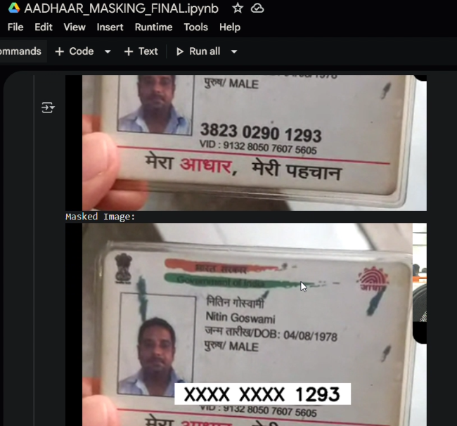
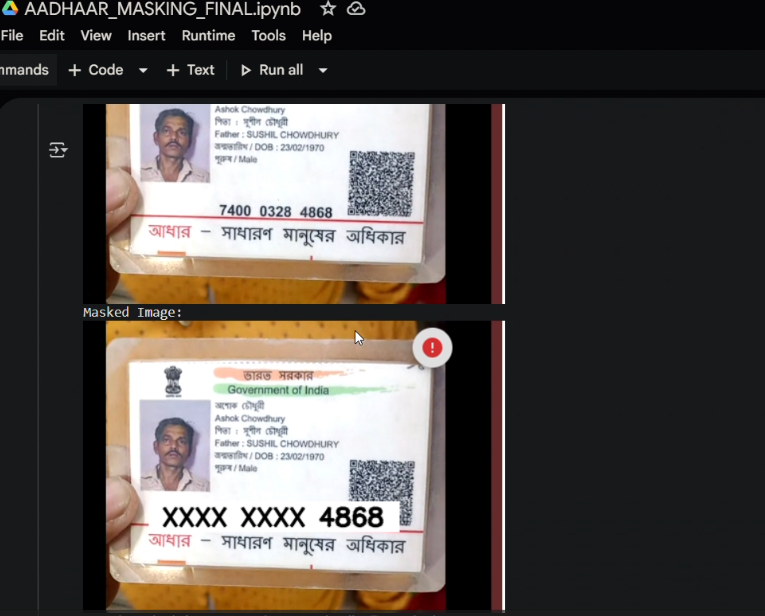
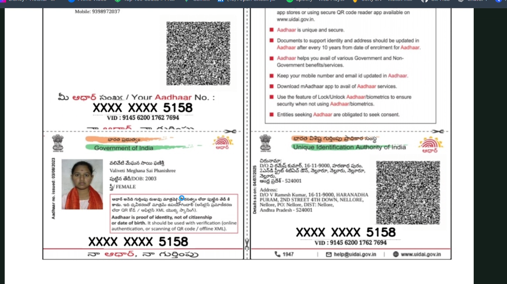

# 🪪 Aadhaar Masker — YOLOv8 + Tesseract + FastAPI

<p align="center">
  
  <br/>
  
  <br/>
  
</p>

<p align="center">
  <a href="https://www.python.org/"></a>
  <a href="https://fastapi.tiangolo.com/"></a>
  <a href="https://github.com/ultralytics/yolov8"></a>
  <a href="https://github.com/tesseract-ocr/tesseract"></a>
</p>

---

**Aadhaar Masker** is a FastAPI-based service that detects Aadhaar numbers in images using a **pre-trained YOLOv8 model** and **Tesseract OCR**, then securely blurs and masks them (keeping only the last 4 digits).  
It includes REST endpoints for both **direct image masking** and **debug visualization**, and is optimized for **deployment via Colab or locally**.

> ⚠️ **Privacy & Legal Disclaimer:**  
> Aadhaar numbers are highly sensitive personal identifiers.  
> Use this tool responsibly and **never upload or share real Aadhaar images publicly.**

---

## 📂 Project Media & Resources
All demo **videos**, **images**, and **assets** used for testing and demonstration are available here:  
📁 [**Google Drive Folder — AADHAAR MASKING DEMO**](https://drive.google.com/drive/folders/1szpD9fldYu59KfEU3MuxUp4LgQPPwx4Y?usp=drive_link)

---

## ✨ Features

✅ **YOLOv8 Aadhaar Number Detection** — Pre-trained model specialized for Aadhaar number regions.  
🔢 **OCR Integration (Tesseract)** — Extracts and analyzes text to identify numeric patterns.  
🌀 **Secure Masking** — Automatically replaces digits with `XXXX XXXX 1234` pattern and applies Gaussian blur.  
⚡ **FastAPI Endpoints:**
- `POST /predict` → Returns masked PNG image.
- `POST /predict_debug` → Returns detections, OCR text, and base64 masked image (for debugging).  

💻 **Supports:**
- Running in **Google Colab**  
- **Local execution** on any Python environment  

---

## 🛠 Installation

1. **Clone this repository**
   ```bash
   git clone https://github.com/Arpan-Ghosh-G/Digital-Aadhaar-Masking.git
   cd Digital-Aadhaar-Masking
